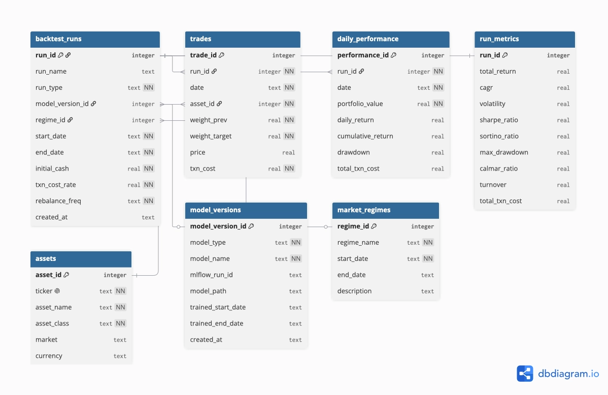

# RobuSTAM — DB 스키마 설계서 v0.1

> 백테스트 실행 이력·성과 지표를 저장하는 SQLite 스키마 설계.
> Feature Store 메타DB(`data/feature_store/meta.sqlite`)와는 별개 저장소로,
> 이쪽은 [docs/backtest_engine.md](backtest_engine.md)(`src/backtest/`)의 실행 로그 저장에 대응한다.
> 실제 DDL·마이그레이션 구현 시 이 문서를 SSOT로 맞추고, 구현 결과가 다르면 이 문서를 갱신한다.

---

## 1. ER 다이어그램

## 2. 테이블 관계

| 관계 | 카디널리티 | 의미 |
|---|---|---|
| model_versions → backtest_runs | 1 : N | 모델 버전 하나로 여러 실행 (벤치마크 실행은 NULL) |
| market_regimes → backtest_runs | 1 : N | 국면 한정 실행 (NULL이면 전기간) |
| backtest_runs → trades | 1 : N | 실행별 날짜·자산 배분 이력 |
| backtest_runs → daily_performance | 1 : N | 실행별 일별 성과 |
| backtest_runs → run_metrics | 1 : 1 | 실행별 최종 지표 |
| assets → trades | 1 : N | 자산별 거래 참조 |

---

## 3. 테이블 정의

### `backtest_runs` — 백테스트 실행 1회

| 컬럼 | 타입 | 키/제약 | 설명 |
|---|---|---|---|
| run_id | INTEGER | PK, AUTOINCREMENT | 실행 고유 ID |
| run_name | TEXT | | 실행 이름 |
| run_type | TEXT | NOT NULL | RL_PPO / RL_SAC / EQUAL_WEIGHT / SIXTY_FORTY / BUY_AND_HOLD |
| model_version_id | INTEGER | FK → model_versions, NULL | 벤치마크 실행은 NULL |
| regime_id | INTEGER | FK → market_regimes, NULL | NULL=전기간, 비NULL=국면 한정 |
| start_date | TEXT | NOT NULL | 백테스트 시작일 |
| end_date | TEXT | NOT NULL | 백테스트 종료일 |
| initial_cash | REAL | NOT NULL | 초기 투자 금액 |
| txn_cost_rate | REAL | NOT NULL, default 0.001 | 편도 거래비용률 0.1%(CLAUDE.md §2) |
| rebalance_freq | TEXT | NOT NULL, default 'daily' | 리밸런싱 주기 |
| created_at | TEXT | default CURRENT_TIMESTAMP | 생성 시각 |

### `trades` — 날짜·자산별 리밸런싱 배분

| 컬럼 | 타입 | 키/제약 | 설명 |
|---|---|---|---|
| trade_id | INTEGER | PK, AUTOINCREMENT | 거래 이력 고유 ID |
| run_id | INTEGER | FK → backtest_runs, NOT NULL, ON DELETE CASCADE | 실행 ID |
| date | TEXT | NOT NULL | 거래일 |
| asset_id | INTEGER | FK → assets, NOT NULL | 자산 ID |
| weight_prev | REAL | NOT NULL | 직전 비중 |
| weight_target | REAL | NOT NULL | 목표 비중 (변화량은 target−prev 파생, 미저장) |
| price | REAL | | 거래 시점 가격 |
| txn_cost | REAL | NOT NULL, default 0 | 거래비용 |

**제약:** `UNIQUE (run_id, date, asset_id)` · **인덱스:** `(run_id, date)`

### `daily_performance` — 일별 포트폴리오 성과

| 컬럼 | 타입 | 키/제약 | 설명 |
|---|---|---|---|
| performance_id | INTEGER | PK, AUTOINCREMENT | 성과 기록 ID |
| run_id | INTEGER | FK → backtest_runs, NOT NULL, ON DELETE CASCADE | 실행 ID |
| date | TEXT | NOT NULL | 날짜 |
| portfolio_value | REAL | NOT NULL | 포트폴리오 가치 |
| daily_return | REAL | | 일별 수익률 |
| cumulative_return | REAL | | 누적 수익률 (파생·비정규화) |
| drawdown | REAL | | 낙폭 (파생·비정규화) |
| total_txn_cost | REAL | default 0 | 해당일 총 거래비용 = Σ trades.txn_cost |

**제약:** `UNIQUE (run_id, date)`

### `run_metrics` — 실행 최종 성과 지표 (run과 1:1)

| 컬럼 | 타입 | 키/제약 | 설명 |
|---|---|---|---|
| run_id | INTEGER | PK, FK → backtest_runs, ON DELETE CASCADE | 실행 ID |
| total_return | REAL | | 총 수익률 |
| cagr | REAL | | 연평균 성장률 |
| volatility | REAL | | 변동성 |
| sharpe_ratio | REAL | | 샤프 지수 |
| sortino_ratio | REAL | | 소르티노 지수 |
| max_drawdown | REAL | | 최대 낙폭 |
| calmar_ratio | REAL | | 칼마 지수 |
| turnover | REAL | | 평균 회전율 |
| total_txn_cost | REAL | | 전체 거래비용 |

### `assets` — 자산 정보 (고정 5종)

| 컬럼 | 타입 | 키/제약 | 설명 |
|---|---|---|---|
| asset_id | INTEGER | PK | 0..4, 고정순서 `[SPY,EWY,TLT,GLD,SHV]`와 일치(CLAUDE.md §2) |
| ticker | TEXT | NOT NULL, UNIQUE | 자산 티커 |
| asset_name | TEXT | NOT NULL | 자산 이름 |
| asset_class | TEXT | NOT NULL | 자산군 |
| market | TEXT | | 시장 |
| currency | TEXT | default 'USD' | 통화 |

**시드 데이터:** SPY(미국주식) · EWY(한국주식) · TLT(미국장기채) · GLD(금) · SHV(단기채/현금성)

### `model_versions` — 학습 모델 버전

| 컬럼 | 타입 | 키/제약 | 설명 |
|---|---|---|---|
| model_version_id | INTEGER | PK, AUTOINCREMENT | 모델 버전 ID |
| model_type | TEXT | NOT NULL | PPO, SAC |
| model_name | TEXT | NOT NULL | 모델 이름 |
| mlflow_run_id | TEXT | | MLflow 실행 ID |
| model_path | TEXT | | 모델 저장 경로 |
| trained_start_date | TEXT | | 학습 데이터 시작일 |
| trained_end_date | TEXT | | 학습 데이터 종료일 |
| created_at | TEXT | default CURRENT_TIMESTAMP | 생성 시각 |

### `market_regimes` — 시장 국면

| 컬럼 | 타입 | 키/제약 | 설명 |
|---|---|---|---|
| regime_id | INTEGER | PK, AUTOINCREMENT | 국면 ID |
| regime_name | TEXT | NOT NULL | 국면 이름 |
| start_date | TEXT | NOT NULL | 국면 시작일 |
| end_date | TEXT | | 국면 종료일 (진행중이면 NULL) |
| description | TEXT | | 설명 |

---

## 변경 이력
| 버전 | 날짜 | 내용 |
|---|---|---|
| v0.1 | 2026-07-13 | 노션 "DB 스키마" 페이지를 저장소로 이관·정리. |
