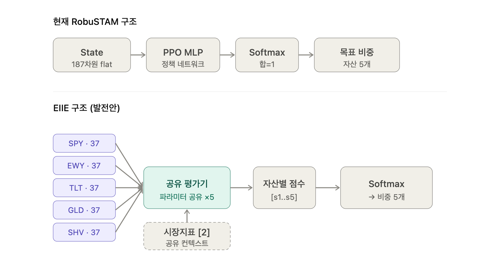

# RobuSTAM — 관련 논문 정리 및 모델 발전 아이디어 v0.1

> 정책망(`src/models/`, 담당: 도현) 아키텍처를 발전시킬 때 참고할 리서치 노트.
> 여기 담긴 내용은 **아이디어/제안**이며, State 187차원·자산 순서 등 [CLAUDE.md §2](../CLAUDE.md)
> 핵심 규칙을 변경하지 않는다. 실제 적용 여부는 도현이 모델 실험 브랜치에서 자유롭게 검토한다.

원문: [Jiang, Xu & Liang — A Deep Reinforcement Learning Framework for the Financial Portfolio Management Problem](references/eiie_portfolio_management.pdf)

---

## 1. 논문 핵심 개념 요약

| 개념 | 정의 |
|---|---|
| Price Vector `v_t` | 시점 t의 전 자산 종가 벡터 (논문은 첫 원소를 Cash=1로 고정) |
| Price Relative `y_t` | 가격 변화율 벡터 (`v_t / v_{t-1}`) — 가격대가 다른 자산을 동일 기준으로 비교 |
| Portfolio Weight `w_t` | 자산별 투자비중, `Σw=1`. 에이전트의 Action |
| Transaction Remainder Factor `μ_t` | 거래비용 차감 후 남는 자산 비율(0<μ≤1). 거래비용 반영 시 `r_t = ln(μ_t · y_t · w_{t-1})` |
| State | `s_t = (X_t, w_{t-1})` — 최근 가격 텐서 + 직전 포트폴리오 비중 |
| Full Exploitation | 과거 시장 데이터가 고정돼 있으므로 일반 RL의 탐험(Exploration) 없이, 동일 데이터로 다양한 정책을 평가 |

**RobuSTAM과의 대응 관계**: 로그수익률 기반 보상, 거래비용의 보상 반영, `prev_weight`를 State에 포함해 거래비용을 인식하는 구조 모두 이 논문의 설계를 따른다. 다만 논문은 DPG(Deterministic Policy Gradient)를, RobuSTAM은 PPO를 사용한다는 점이 다르다.

---

## 2. 모델 발전 아이디어 — EIIE (Ensemble of Identical Independent Evaluators)

논문 5장에서 제안하는 정책망 구조로, RobuSTAM 발전 방향 중 가장 유효성이 커 보이는 아이디어.

### 2-1. 문제의식 — 현재(Flat MLP) 구조의 한계

```
187차원 flat State ──▶ MLP ──▶ Softmax ──▶ [SPY,EWY,TLT,GLD,SHV] 비중
```

| 약점 | 내용 |
|---|---|
| 확장성 없음 | 자산이 늘면 입력 차원·네트워크 크기가 함께 커짐. 자산 추가 = 구조 재설계·재학습 |
| 위치 편향 | 입력 앞쪽(SPY)·뒤쪽(SHV)을 다른 뉴런이 담당 → "자산을 평가하는 일반 능력"이 아니라 "SPY 자리의 특정 패턴"을 외움 → 과적합 |
| 데이터 비효율 | 자산별 시계열은 사실 같은 평가 과제의 다른 표본인데, 큰 MLP는 이를 공유 학습하지 못함 |

강건성(Robustness)이 목표인 RobuSTAM에서 위치 편향으로 인한 과적합은 특히 치명적이다.

### 2-2. EIIE 구조

**E**nsemble of **I**dentical **I**ndependent **E**valuators — 자산 하나의 시계열을 입력받아 매력도 점수(scalar) 하나를 내는 **동일 파라미터를 공유하는 작은 평가기**를 자산마다 반복 적용하고, 점수 벡터를 Softmax에 넣어 비중을 만든다.



| 항목 | 현재 (Flat MLP) | EIIE (발전안) |
|---|---|---|
| 입력 처리 | 187차원을 한 줄로 이어붙여 통째 입력 | 자산별 37차원 블록으로 분리 (수익30+지표6+직전비중1) |
| 평가 주체 | 자산마다 다른 뉴런이 담당 | 파라미터 공유 평가기 1개를 5회 적용 |
| 위치 편향 | 있음 | 없음 (순열 등변) |
| 파라미터 수 | 자산 수에 비례해 증가 | 자산 수와 무관(고정) |
| 일반화/강건성 | 과적합 취약 | 자산 불문 일반 능력 학습 |
| 거래비용 인식 | prev_weight를 flat에 섞음 | prev_weight = PVM으로 명시적 반영 |
| 시장 공통지표 | flat에 함께 섞임 | 공유 컨텍스트로 별도 주입(자산별 복제 금지) |
| 자산 간 상관 | MLP가 암묵적으로 볼 여지 | 평가기 독립 → 직접 못 봄(보완 필요) |
| State 명세 변경 | — | 불필요(정책망 내부 reshape만) |

### 2-3. RobuSTAM에 이식하기 쉬운 이유

[docs/state_spec.md](state_spec.md) §3 인덱스맵이 이미 자산별 블록 구조라 EIIE 적용에 유리하다.

| 블록 | 인덱스 | 구조 |
|---|---|---|
| 수익률 윈도우 | `[0:150]` | 자산 5 × 30일 → 자산별 분리 가능 |
| 자산별 지표 | `[150:180]` | 자산 5 × 6지표 → 자산별 분리 가능 |
| 시장 공통지표 | `[180:182]` | Equity_Bond_Ratio, Gold_Vol_Ratio → 전 자산 공유(글로벌) |
| 직전 비중 | `[182:187]` | 자산 5 × 1 → PVM(Portfolio-Vector Memory)에 정확히 대응 |

```
EIIE화: 자산 i 블록 = [수익률30 + 지표6 + 직전비중1] = 37차원
        └─▶ 공유 평가기 W ─▶ 점수 sᵢ   (i=1..5 반복)
        시장지표2 = 모든 평가기에 공유 컨텍스트로 주입
        [s1..s5] ─▶ softmax ─▶ 비중5개
```

**중요:** State 187차원·자산 순서(§2 절대 변경 금지)는 그대로 유지되고, 정책망 내부에서 reshape만 하므로 State 명세를 건드리지 않는다. `src/models` 영역만 변경해 실험 가능한 비파괴적 업그레이드.

### 2-4. 주의할 점

1. **자산 간 상관을 직접 모델링하지 못함** — 평가기가 독립적이라 SPY–TLT 음의 상관 같은 분산투자 신호를 내부에서 못 봄(마지막 Softmax의 상대비교가 전부). 보완책: ① 시장 공통지표를 모든 평가기에 글로벌 컨텍스트로 주입(이미 반영), ② 평가기 뒤에 가벼운 cross-asset 레이어를 추가하는 하이브리드 검토.
2. **시장 공통지표는 "독립" 원칙과 충돌** — `[180:182]`는 자산별 값이 아니라 시장 전체 단일값. `schema.py`의 SSOT 경고("자산별로 곱하지 말 것")와 같은 맥락 — 평가기마다 복제해 곱하면 안 되고 공유 입력으로만 넣어야 한다.
3. **§2 핵심 규칙 변경 아님** — 자산 5종·순서·거래비용은 그대로. EIIE는 정책망 아키텍처 실험이므로 회의 합의 없이도 모델 브랜치에서 탐색 가능하다.

---

## 3. 파생 아이디어

### 3-1. 거래비용 민감도 실험

CLAUDE.md 정량목표의 "국면별 유효성·한계 검증" 철학과 직결되는 실험. 거래비용률을 바꿔가며 PPO를 재학습하고 아래 지표를 비교한다.

| 거래비용률 | 목적 |
|---|---|
| 0% | 이상적인 성능(상한) 확인 |
| 0.05% | 낮은 비용 환경 |
| 0.1% | 기본 설정(CLAUDE.md §2 확정값) |
| 0.2% | 보수적 환경 |
| 0.3% | 높은 비용 환경 |

비교 지표: Final Portfolio Value · Cumulative/Annualized Return · Sharpe Ratio · Max Drawdown · Turnover · Transaction Cost Paid.

### 3-2. 자산별 비중 해석가능성

EIIE 적용 시 Softmax 이전의 자산별 점수(`s_1..s_5`)를 로깅하면, 특정 국면에서 왜 특정 자산 비중이 늘었는지 해석에 활용 가능.

| 시장 상황 | 기대되는 해석 |
|---|---|
| 주식 상승장 | SPY, EWY 비중 증가 |
| 위험 회피 국면 | TLT, GLD, SHV 비중 증가 |
| 변동성 증가 | SHV 또는 GLD 비중 증가 |
| 금리 불안정 | TLT 비중 변화 확인 |

EIIE를 쓰지 않더라도, 자산별 비중과 비중 변화량(`w_t - w_{t-1}`)을 시계열로 저장해두면 동일한 해석 분석이 가능하다.

---

## 변경 이력
| 버전 | 날짜 | 내용 |
|---|---|---|
| v0.1 | 2026-07-13 | 노션 "관련 논문 정리" 페이지를 저장소로 이관·정리. |
